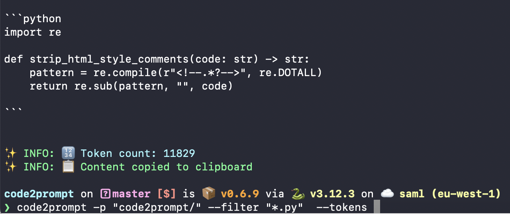
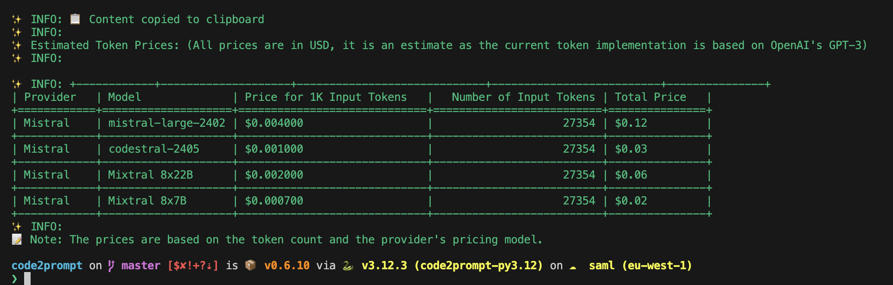
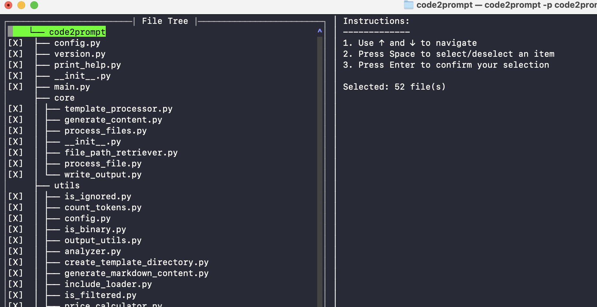

# Code2Prompt

[](https://badge.fury.io/py/code2prompt)

[](https://github.com/raphaelmansuy/code2prompt/stargazers)
[](https://github.com/raphaelmansuy/code2prompt/network/members)
[](https://pypi.org/project/code2prompt/)
[](https://pypi.org/project/code2prompt/)
[](https://opensource.org/licenses/MIT)

Code2Prompt is a powerful command-line tool that generates comprehensive prompts from codebases, designed to streamline interactions between developers and Large Language Models (LLMs) for code analysis, documentation, and improvement tasks.

## Table of Contents

1. [Why Code2Prompt?](#why-code2prompt)
2. [Features](#features)
3. [Installation](#installation)
4. [Getting Started](#getting-started)
5. [Quick Start](#quick-start)
6. [Usage](#usage)
7. [Options](#options)
8. [Examples](#examples)
9. [Templating System](#templating-system)
10. [Integration with LLM CLI](#integration-with-llm-cli)
11. [GitHub Actions Integration](#github-actions-integration)
12. [Configuration File](#configuration-file)
13. [Troubleshooting](#troubleshooting)
14. [Contributing](#contributing)
15. [License](#license)

# Code2Prompt: Transform Your Codebase into AI-Ready Prompts

[](https://badge.fury.io/py/code2prompt)
[](https://github.com/raphaelmansuy/code2prompt/stargazers)
[](https://opensource.org/licenses/MIT)



## Supercharge Your AI-Assisted Development

Code2Prompt is a powerful, open-source command-line tool that bridges the gap between your codebase and Large Language Models (LLMs). By converting your entire project into a comprehensive, AI-friendly prompt, Code2Prompt enables you to leverage the full potential of AI for code analysis, documentation, and improvement tasks.

### 🚀 Key Features

- **Holistic Codebase Representation**: Generate a well-structured Markdown prompt that captures your entire project's essence, making it easier for LLMs to understand the context.
- **Intelligent Source Tree Generation**: Create a clear, hierarchical view of your codebase structure, allowing for better navigation and understanding of the project.
- **Customizable Prompt Templates**: Tailor your output using Jinja2 templates to suit specific AI tasks, enhancing the relevance of generated prompts.
- **Smart Token Management**: Count and optimize tokens to ensure compatibility with various LLM token limits, preventing errors during processing.
- **Gitignore Integration**: Respect your project's .gitignore rules for accurate representation, ensuring that irrelevant files are excluded from processing.
- **Flexible File Handling**: Filter and exclude files using powerful glob patterns, giving you control over which files are included in the prompt generation.
- **Custom Syntax Highlighting**: Pair custom file extensions with specific syntax highlighting using the `--syntax-map` option. For example, you can specify that `.inc` files should be treated as `bash` scripts.
- **Clipboard Ready**: Instantly copy generated prompts to your clipboard for quick AI interactions, streamlining your workflow.
- **Multiple Output Options**: Save to file or display in the console, providing flexibility in how you want to use the generated prompts.
- **Enhanced Code Readability**: Add line numbers to source code blocks for precise referencing, making it easier to discuss specific parts of the code.
- **Include file**: Support of template import, allowing for modular template design.
- **Input variables**: Support of Input Variables in templates, enabling dynamic prompt generation based on user input.

### 💡 Why Code2Prompt?

- **Contextual Understanding**: Provide LLMs with a comprehensive view of your project for more accurate suggestions and analysis.
- **Consistency Boost**: Maintain coding style and conventions across your entire project, improving code quality.
- **Efficient Refactoring**: Enable better interdependency analysis and smarter refactoring recommendations, saving time and effort.
- **Improved Documentation**: Generate contextually relevant documentation that truly reflects your codebase, enhancing maintainability.
- **Pattern Recognition**: Help LLMs learn and apply your project-specific patterns and idioms, improving the quality of AI interactions.

Transform the way you interact with AI for software development. With Code2Prompt, harness the full power of your codebase in every AI conversation.

Ready to elevate your AI-assisted development? Let's dive in! 🏊‍♂️

## Installation

Choose one of the following methods to install Code2Prompt:

### Using pip 

```bash
pip install code2prompt
```
### Using [pipx](https://github.com/pypa/pipx) (recommended)

```bash
pipx install code2prompt
```

## Getting Started

To get started with Code2Prompt, follow these steps:

1. **Install Code2Prompt**: Use one of the installation methods mentioned above.
2. **Prepare Your Codebase**: Ensure your project is organized and that you have a `.gitignore` file if necessary.
3. **Run Code2Prompt**: Use the command line to generate prompts from your codebase.

For example, to generate a prompt from a single Python file, run:

```bash
code2prompt --path /path/to/your/script.py
```

## Quick Start

1. Generate a prompt from a single Python file:
   ```bash
   code2prompt --path /path/to/your/script.py
   ```

2. Process an entire project directory and save the output:
   ```bash
   code2prompt --path /path/to/your/project --output project_summary.md
   ```

3. Generate a prompt for multiple files, excluding tests:
   ```bash
   code2prompt --path /path/to/src --path /path/to/lib --exclude "*/tests/*" --output codebase_summary.md
   ```

## Usage

The basic syntax for Code2Prompt is:

```bash
code2prompt --path /path/to/your/code [OPTIONS]
```

For multiple paths:

```bash
code2prompt --path /path/to/dir1 --path /path/to/file2.py [OPTIONS]
```

### Custom Syntax Highlighting

To pair custom file extensions with specific syntax highlighting, use the `--syntax-map` option. This allows you to specify mappings in the format `extension:syntax`. For example:

```
code2prompt --path /path/to/your/code --syntax-map "inc:bash,customext:python,ext2:javascript"
```

This command will treat `.inc` files as `bash` scripts, `.customext` files as `python`, and `.ext2` files as `javascript`.

You can also use multiple `--syntax-map` arguments or separate mappings with commas:

```
code2prompt --path /path/to/your/script.py --syntax-map "inc:bash"
```

```
code2prompt --path /path/to/your/project --syntax-map "inc:bash,txt:markdown" --output project_summary.md
```

```
code2prompt --path /path/to/src --path /path/to/lib --syntax-map "inc:bash,customext:python" --output codebase_summary.md
```

## Options

| Option | Short | Description |
|--------|-------|-------------|
| `--path` | `-p` | Path(s) to the directory or file to process (required, multiple allowed) |
| `--output` | `-o` | Name of the output Markdown file |
| `--gitignore` | `-g` | Path to the .gitignore file |
| `--filter` | `-f` | Comma-separated filter patterns to include files (e.g., "*.py,*.js") |
| `--exclude` | `-e` | Comma-separated patterns to exclude files (e.g., "*.txt,*.md") |
| `--case-sensitive` | | Perform case-sensitive pattern matching |
| `--suppress-comments` | `-s` | Strip comments from the code files |
| `--line-number` | `-ln` | Add line numbers to source code blocks |
| `--no-codeblock` | | Disable wrapping code inside markdown code blocks |
| `--template` | `-t` | Path to a Jinja2 template file for custom prompt generation |
| `--tokens` | | Display the token count of the generated prompt |
| `--encoding` | | Specify the tokenizer encoding to use (default: "cl100k_base") |
| `--create-templates` | | Create a templates directory with example templates |
| `--version` | `-v` | Show the version and exit |
| `--log-level` | | Set the logging level (e.g., DEBUG, INFO, WARNING, ERROR, CRITICAL) |
| `--interactive` | `-i` | Activate interactive mode for file selection |
| `--syntax-map` | | Pair custom file extensions with specific syntax highlighting (e.g., "inc:bash,customext:python,ext2:javascript") |

## Command Parameters

### `--filter` or `-f` and `--exclude` or `-e`

The `--filter` and `--exclude` options allow you to specify patterns for files or directories that should be included in or excluded from processing, respectively.

#### Syntax:
```
--filter "PATTERN1,PATTERN2,..."
--exclude "PATTERN1,PATTERN2,..."
```
or
```
-f "PATTERN1,PATTERN2,..."
-e "PATTERN1,PATTERN2,..."
```

#### Description:
- Both options accept a comma-separated list of patterns.
- Patterns can include wildcards (`*`) and directory indicators (`**`).
- Case-sensitive by default (use `--case-sensitive` flag to change this behavior).
- `--exclude` patterns take precedence over `--filter` patterns.

#### Examples:

1. Include only Python files:
   ```
   --filter "**.py"
   ```

2. Exclude all Markdown files:
   ```
   --exclude "**.md"
   ```

3. Include specific file types in the src directory:
   ```
   --filter "src/**.{js,ts}"
   ```

4. Exclude multiple file types and a specific directory:
   ```
   --exclude "**.log,**.tmp,**/node_modules/**"
   ```

5. Include all files except those in 'test' directories:
   ```
   --filter "**" --exclude "**/test/**"
   ```

6. Complex filtering (include JavaScript files, exclude minified and test files):
   ```
   --filter "**.js" --exclude "**.min.js,**test**.js"
   ```

7. Include specific files across all directories:
   ```
   --filter "**/config.json,**/README.md"
   ```

8. Exclude temporary files and directories:
   ```
   --exclude "**/.cache/**,**/tmp/**,**.tmp"
   ```

9. Include source files but exclude build output:
   ```
   --filter "src/**/*.{js,ts}" --exclude "**/dist/**,**/build/**"
   ```

10. Exclude version control and IDE-specific files:
    ```
    --exclude "**/.git/**,**/.vscode/**,**/.idea/**"
    ```

#### Important Notes:

- Always use double quotes around patterns to prevent shell interpretation of special characters.
- Patterns are matched against the full path of each file, relative to the project root.
- The `**` wildcard matches any number of directories.
- Single `*` matches any characters within a single directory or filename.
- Use commas to separate multiple patterns within the same option.
- Combine `--filter` and `--exclude` for fine-grained control over which files are processed.

#### Best Practices:

1. Start with broader patterns and refine as needed.
2. Test your patterns on a small subset of your project first.
3. Use the `--case-sensitive` flag if you need to distinguish between similarly named files with different cases.
4. When working with complex projects, consider using a configuration file to manage your filter and exclude patterns.

By using the `--filter` and `--exclude` options effectively and safely (with proper quoting), you can precisely control which files are processed in your project, ensuring both accuracy and security in your command execution.

## Examples

1. Generate documentation for a Python library:
   ```bash
   code2prompt --path /path/to/library --output library_docs.md --suppress-comments --line-number --filter "*.py"
   ```

2. Prepare a codebase summary for a code review, focusing on JavaScript and TypeScript files:
   ```bash
   code2prompt --path /path/to/project --filter "*.js,*.ts" --exclude "node_modules/*,dist/*" --template code_review.j2 --output code_review.md
   ```

3. Create input for an AI model to suggest improvements, focusing on a specific directory:
   ```bash
   code2prompt --path /path/to/src/components --suppress-comments --tokens --encoding cl100k_base --output ai_input.md
   ```

4. Analyze comment density across a multi-language project:
   ```bash
   code2prompt --path /path/to/project --template comment_density.j2 --output comment_analysis.md --filter "*.py,*.js,*.java"
   ```

5. Generate a prompt for a specific set of files, adding line numbers:
   ```bash
   code2prompt --path /path/to/important_file1.py --path /path/to/important_file2.js --line-number --output critical_files.md
   ```

## Templating System

Code2Prompt supports custom output formatting using Jinja2 templates. To use a custom template:

```bash
code2prompt --path /path/to/code --template /path/to/your/template.j2
```

### Creating Template Examples

Use the `--create-templates` command to generate example templates:

```bash
code2prompt --create-templates
```

This creates a `templates` directory with sample Jinja2 templates, including:

- [default.j2](./code2prompt//templates/default.j2): A general-purpose template
- [analyze-code.j2](./code2prompt/templates/analyze-code.j2): For detailed code analysis
- [code-review.j2](./code2prompt/templates/code-review.j2): For thorough code reviews
- [create-readme.j2](./code2prompt/templates/create-readme.j2): To assist in generating README files
- [improve-this-prompt.j2](./code2prompt/templates/improve-this-prompt.j2): For refining AI prompts

For full template documentation, see [Documentation Templating](./TEMPLATE.md).

## Integration with LLM CLI

Code2Prompt can be integrated with Simon Willison's [llm](https://github.com/simonw/llm) CLI tool for enhanced code analysis or [qllm](https://github.com/quantalogic/qllm), or for the Rust lovers [hiramu-cli](https://github.com/raphaelmansuy/hiramu-cli). 

### Installation

```bash
pip install code2prompt llm
```

### Basic Usage

1. Generate a code summary and analyze it with an LLM:
   ```bash
   code2prompt --path /path/to/your/project | llm "Analyze this codebase and provide insights on its structure and potential improvements"
   ```

2. Process a specific file and get refactoring suggestions:
   ```bash
   code2prompt --path /path/to/your/script.py | llm "Suggest refactoring improvements for this code"
   ```

For more advanced use cases, refer to the [Integration with LLM CLI](#integration-with-llm-cli) section in the full documentation.

## GitHub Actions Integration

You can integrate Code2Prompt into your GitHub Actions workflow. Here's an example:

```yaml
name: Code Analysis
on: [push]
jobs:
  analyze-code:
    runs-on: ubuntu-latest
    steps:
    - uses: actions/checkout@v2
    - name: Set up Python
      uses: actions/setup-python@v2
      with:
        python-version: '3.x'
    - name: Install dependencies
      run: |
        pip install code2prompt llm
    - name: Analyze codebase
      run: |
        code2prompt --path . | llm "Perform a comprehensive analysis of this codebase. Identify areas for improvement, potential bugs, and suggest optimizations." > analysis.md
    - name: Upload analysis
      uses: actions/upload-artifact@v2
      with:
        name: code-analysis
        path: analysis.md
```

## Understanding Tokens and Token Types in Code2Prompt

Tokens are the basic units of text that language models process. They can be words, parts of words, or even punctuation marks. Different tokenizer encodings split text into tokens in various ways. Code2Prompt supports multiple token types through its `--encoding` option, with "cl100k_base" as the default. This encoding, used by models like GPT-3.5 and GPT-4, is adept at handling code and technical content. Other common encodings include "p50k_base" (used by earlier GPT-3 models) and "r50k_base" (used by models like CodeX).

To count tokens in your generated prompt, use the `--tokens` flag:

```bash
code2prompt --path /your/project --tokens
```

For a specific encoding:

```bash
code2prompt --path /your/project --tokens --encoding p50k_base
```

Understanding token counts is crucial when working with AI models that have token limits, ensuring your prompts fit within the model's context window.

### Token Price Estimation

Code2Prompt now includes a powerful feature for estimating token prices across various AI providers and models. Use the `--price` option in conjunction with `--tokens` to display a comprehensive breakdown of estimated costs. This feature calculates prices based on both input and output tokens, with input tokens determined by your codebase and a default of 1000 output tokens (customizable via `--output-tokens`). You can specify a particular provider or model, or view prices across all available options. This functionality helps developers make informed decisions about AI model usage and cost management. For example:

```bash
code2prompt --path /your/project --tokens --price --provider openai --model gpt-4
```

This command will analyze your project, count the tokens, and provide a detailed price estimation for OpenAI's GPT-4 model.



## 🔥 Analyzing Codebases

code2prompt now offers a powerful feature to analyze codebases and provide a summary of file extensions. Use the `--analyze` option along with the `-p` (path) option to get an overview of your project's file composition. For example:

```
code2prompt --analyze -p code2prompt
```

Result:

```
.j2: 6 files
.json: 1 file
.py: 33 files
.pyc: 56 files

Comma-separated list of extensions:
.j2,.json,.py,.pyc
```

This command will analyze the 'code2prompt' directory and display a summary of all file extensions found, including their counts. You can choose between two output formats:

- Flat format (default): Lists all unique extensions alphabetically with their file counts.
- Tree-like format: Displays extensions in a directory tree structure with counts at each level.

To use the tree-like format, add the `--format tree` option:

```
code2prompt --analyze -p code2prompt --format tree
```

Result: 

```
└── code2prompt
    ├── utils
    │   ├── .py
    │   └── __pycache__
    │       └── .pyc
    ├── .py
    ├── core
    │   ├── .py
    │   └── __pycache__
    │       └── .pyc
    ├── comment_stripper
    │   ├── .py
    │   └── __pycache__
    │       └── .pyc
    ├── __pycache__
    │   └─ .pyc
    ├── templates
    │   └── .j2
    └── data
        └── .json

Comma-separated list of extensions:
.j2,.json,.py,.pyc
```

The analysis also generates a comma-separated list of file extensions, which can be easily copied and used with the `--filter` option for more targeted code processing.

## 🔥 Feature Highlight: Dynamic Variable Extraction for Prompt Generation

`code2prompt` offers a powerful feature for dynamic variable extraction from templates, allowing for interactive and customizable prompt generation. Using the syntax `{{input:variable_name}}`, you can easily define variables that will prompt users for input during execution. 

This is particularly useful for creating flexible templates for various purposes, such as generating AI prompts for Chrome extensions. Here's an example:

```jinja2
# AI Prompt Generator for Chrome Extension

Generate a prompt for an AI to create a Chrome extension with the following specifications:

Extension Name: {{input:extension_name}}
Main Functionality: {{input:main_functionality}}
Target Audience: {{input:target_audience}}

## Prompt:

You are an experienced Chrome extension developer. Create a detailed plan for a Chrome extension named "{{input:extension_name}}" that {{input:main_functionality}}. This extension is designed for {{input:target_audience}}.

Your response should include:

1. A brief description of the extension's purpose and functionality
2. Key features (at least 3)
3. User interface design considerations
4. Potential challenges in development and how to overcome them
5. Security and privacy considerations
6. A basic code structure for the main components (manifest.json, background script, content script, etc.)

Ensure that your plan is detailed, technically sound, and tailored to the needs of {{input:target_audience}}.

Start from this codebase:

---- 

## The codebase:

<codebase>
```

When you run `code2prompt` with this template, it will automatically detect the `{{input:variable_name}}` patterns and prompt the user to provide values for each variable (extension_name, main_functionality, and target_audience). This allows for flexible and interactive prompt generation, making it easy to create customized AI prompts for various Chrome extension ideas.

For example, if a user inputs:
- Extension Name: "ProductivityBoost"
- Main Functionality: "tracks time spent on different websites and provides productivity insights"
- Target Audience: "professionals working from home"

The tool will generate a tailored prompt for an AI to create a detailed plan for this specific Chrome extension. This feature is particularly useful for developers, product managers, or anyone looking to quickly generate customized AI prompts for various projects or ideas.

## 🔥 Feature Highlight "Include File" Feature

The code2prompt project now supports a powerful "include file" feature, enhancing template modularity and reusability.

 This feature allows you to seamlessly incorporate external file content into your main template using the `` directive. For example, in the main `analyze-code.j2` template, you can break down complex sections into smaller, manageable files:

```jinja2
# Elite Code Analyzer and Improvement Strategist 2.0





## Task Breakdown

1. Initial Assessment


2. Multi-Dimensional Analysis (Utilize Tree of Thought)


// ... other sections ...
```

This approach allows you to organize your template structure more efficiently, improving maintainability and allowing for easy updates to specific sections without modifying the entire template. The include feature supports both relative and absolute paths, making it flexible for various project structures. By leveraging this feature, you can significantly reduce code duplication, improve template management, and create a more modular and scalable structure for your code2prompt templates.

## Interactive Mode

The interactive mode allows users to select files for processing in a user-friendly manner. This feature is particularly useful when dealing with large codebases or when you want to selectively include files without manually specifying each path.

### How to Use Interactive Mode

To activate interactive mode, use the `--interactive` or `-i` option when running the `code2prompt` command. Here's an example:

```bash
code2prompt --path /path/to/your/project --interactive
```




### Features of Interactive Mode

- **File Selection**: Navigate through the directory structure and select files using keyboard controls.
- **Visual Feedback**: The interface provides visual cues to help you understand which files are selected or ignored.

### Keyboard Controls

- **Arrow Keys**: Navigate through the list of files.
- **Spacebar**: Toggle the selection of a file.
- **Enter**: Confirm your selection and proceed with the command.
- **Esc**: Exit the interactive mode without making any changes.

This mode enhances the usability of Code2Prompt, making it easier to manage file selections in complex projects.

## Configuration File

Code2Prompt supports a `.code2promptrc` configuration file in JSON format for setting default options. Place this file in your project or home directory.

Example `.code2promptrc`:

```json
{
  "suppress_comments": true,
  "line_number": true,
  "encoding": "cl100k_base",
  "filter": "*.py,*.js",
  "exclude": "tests/*,docs/*"
}
```

## Troubleshooting

1. **Issue**: Code2Prompt is not recognizing my .gitignore file.
   **Solution**: Run Code2Prompt from the project root, or specify the .gitignore path with `--gitignore`.

2. **Issue**: The generated output is too large for my AI model.
   **Solution**: Use `--tokens` to check the count, and refine `--filter` or `--exclude` options.

3. **Issue**: Some files are not being processed.
   **Solution**: Check for binary files or exclusion patterns. Use `--case-sensitive` if needed.

## Roadmap

   - [X] Interactive filtering
   - [X] Include system in template to promote re-usability of sub templates.
   - [X] Support of input variables
   - [ ] Tokens count for Anthropic Models and other models such as LLama3 or Mistral
   - [X] Cost Estimations for main LLM providers based on token count
   - [ ] Integration with [qllm](https://github.com/quantalogic/qllm) (Quantalogic LLM)
   - [ ] Embedding of file summary in SQL-Lite
   - [ ] Intelligence selection of file based on an LLM
   - [ ] Git power tools (Git diff integration / PR Assisted Review)

## Contributing

Contributions to Code2Prompt are welcome! Please read our [Contributing Guide](CONTRIBUTING.md) for details on our code of conduct and the process for submitting pull requests.

## License

Code2Prompt is released under the MIT License. See the [LICENSE](LICENSE) file for details.

---

⭐ If you find Code2Prompt useful, please give us a star on GitHub! It helps us reach more developers and improve the tool. ⭐

## Project Growth
[](https://star-history.com/#raphaelmansuy/code2prompt&Date)

Made with ❤️ by Raphaël MANSUY. Founder of [Quantalogic](https://www.quantalogic.app). Creator of [qllm](https://github.com/quantalogic/qllm).
