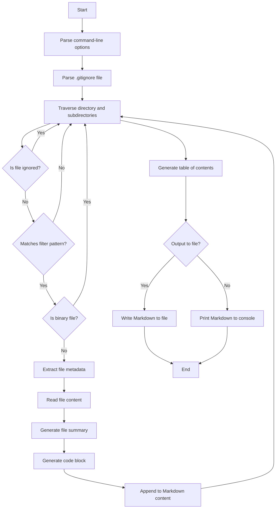

```mermaid
```mermaid
graph TD
    A[Start] --> B[Parse command-line options]
    B --> C[Parse .gitignore file]
    C --> D[Traverse directory and subdirectories]
    D --> E{Is file ignored?}
    E -->|Yes| D
    E -->|No| F{Matches filter pattern?}
    F -->|No| D
    F -->|Yes| G{Is binary file?}
    G -->|Yes| D
    G -->|No| H[Extract file metadata]
    H --> I[Read file content]
    I --> J[Generate file summary]
    J --> K[Generate code block]
    K --> L[Append to Markdown content]
    L --> D
    D --> M[Generate table of contents]
    M --> N{Output to file?}
    N -->|Yes| O[Write Markdown to file]
    N -->|No| P[Print Markdown to console]
    O --> Q[End]
    P --> Q
```
